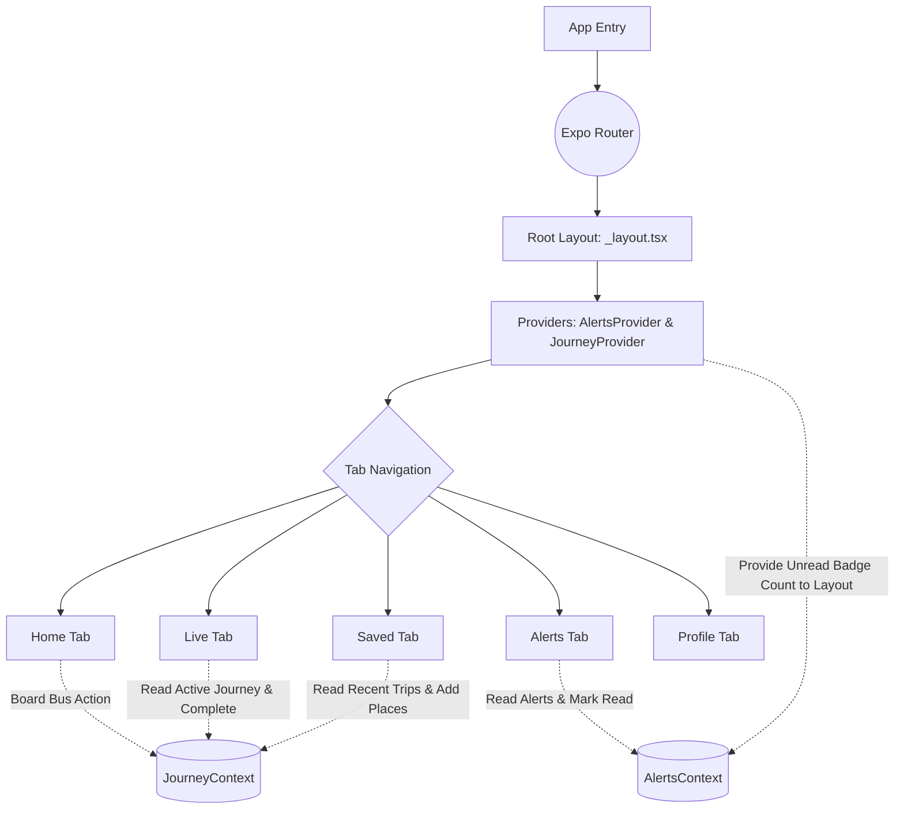

# Raah Commuter App 🚌

Raah Commuter is a modern, beautifully designed React Native application built with Expo to revolutionize the daily public transit experience. It provides commuters with real-time bus tracking, contextual route alerts, saved journeys, and gamified travel statistics.

## ✨ Features

- **Smart Search & Routing (Home)**: Quickly search for buses or destinations, view detailed route steps, and board buses seamlessly.
- **Real-Time Live Tracking (Live)**: Context-aware live tracking! Once you board a bus, the live tab automatically tracks your active journey, providing an interactive timeline, delay status, and one-tap journey completion.
- **Dynamic Alerts (Alerts)**: Stay informed with a global alerts system covering route diversions, weather updates, and delays. Features a global unread badge counter in the navbar that dynamically updates as you read notifications.
- **Saved & History (Saved)**: Quick access to your favorite places (Home, Work, College) and a complete history of your recent trips generated automatically upon completing a live journey.
- **Gamified Profile (Profile)**: Track your environmental impact with CO₂ saved, money saved, and unlock custom achievements based on your travel habits.

---

## 🗺 User Workflow

1. **Discovery**: The user opens the **Home** tab and searches for a destination.
2. **Action**: The user selects a bus (e.g., Bus 507) and taps **"Board Bus"**.
3. **Tracking**: The app contextually switches to the **Live** tab, revealing a draggable bottom sheet with the full route timeline and current location.
4. **Completion**: Upon reaching the destination, the user taps **"Mark Journey Completed"**.
5. **Logging**: The trip is automatically archived in the **Saved** tab under "Recent Trips".
6. **Engagement**: The user checks their **Profile** to see their updated trip count and environmental impact.

---

## 🏗 Architecture & State Management

The application is built on **Expo Router** for file-based routing and uses **React Context API** for lightweight, predictable global state management.



### Key Contexts
- **`JourneyContext`**: Manages the currently boarded bus (`activeJourney`), user's saved locations (`savedPlaces`), and historical trips (`recentTrips`). 
- **`AlertsContext`**: Manages the array of notifications, read/unread status, and dynamically powers the notification badge in the bottom tab bar.

---

## 🚀 Getting Started

Follow these instructions to replicate and run this project on your local device.

### Prerequisites
- Node.js (v18 or newer recommended)
- npm, yarn, or pnpm
- [Expo Go](https://expo.dev/client) app installed on your physical iOS/Android device (or a simulator installed on your computer).

### Installation

1. **Clone the repository**
   ```bash
   git clone https://github.com/Prince-Vaviya/raah-u.git
   cd raah-commuter
   ```

2. **Install Dependencies**
   ```bash
   npm install
   ```

3. **Start the Development Server**
   ```bash
   npm run start
   ```

### Running on your Device

Once the Metro Bundler starts, it will display a large QR code in your terminal.
- **iOS**: Open your default Camera app and scan the QR code. Tap the prompt to open it in **Expo Go**.
- **Android**: Open the **Expo Go** app and tap "Scan QR Code".

*Note: Ensure your phone and your computer are connected to the same Wi-Fi network.*

---

## 🛠 Tech Stack

- **Framework**: [React Native](https://reactnative.dev/)
- **Routing**: [Expo Router v3](https://docs.expo.dev/router/introduction/)
- **Icons**: `@expo/vector-icons` (Ionicons)
- **Styling**: React Native StyleSheet (Vanilla)
- **State**: React Context API
- **Maps**: `react-native-maps`

## 🤝 Contributing
Feel free to open issues or submit pull requests. Ensure all new UI components are placed in `src/components/ui/` and global states are properly segregated in `src/context/`.
